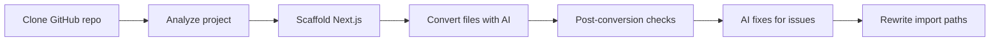

# Lovable converter

> **Work in progress.** This project is not finished. It cannot fully convert a whole Lovable (or similar) app end-to-end—expect gaps, rough edges, and follow-up **developer work** to wire things up, fix regressions, and validate the output (build, tests, auth, env, edge routes, etc.).

CLI tool that clones a **React + Vite** app from GitHub, analyzes it (AST + optional AI), scaffolds a **Next.js App Router** project, and migrates routes and components with **OpenAI**-assisted code generation. The converted app is written under `server/next-output/<job-id>/`.

## Prerequisites

- **Node.js** (LTS recommended)
- **Git** (for cloning source repos)
- **Yarn** — `create-next-app` is invoked with `--use-yarn`; Yarn must be available on your PATH
- **OpenAI API key** with access to the model configured in `server/config.ts` (default: `gpt-4.1-mini`)

## Setup

1. Clone this repository.
2. From the **`server`** directory:

   ```bash
   cd server
   yarn install   # or: npm install
   ```

3. Copy `server/.env.example` to `server/.env` and set:

   ```env
   OPENAI_API_KEY=sk-...
   SOURCE_REPO_URL=https://github.com/owner/repo.git
   ```

   `SOURCE_REPO_URL` must be a public `https://github.com/...` URL (see `server/utils/clone-repo.ts`). Env vars load at process start via `dotenv` in `server/index.ts` and `server/openai/index.ts`.

## How to run

**Always run the app with the current working directory set to `server`**, so paths like `next-output/`, `analysis/`, and the clone target resolve correctly.

```bash
cd server
yarn dev        # or: npx tsx watch index.ts / npm run dev
```

Or build and run:

```bash
yarn build && yarn start   # or: npm run build && npm start
```

### Which repository gets converted?

Set **`SOURCE_REPO_URL`** in `server/.env` to the **public** `https://github.com/owner/repo.git` you want to migrate. If it is missing, `init()` exits with an error. Only `github.com` HTTPS URLs are accepted (`server/utils/clone-repo.ts`).

### Test mode (no clone)

With `IS_TESTING: true` in `server/config.ts`, the app skips `cloneGithubRepo` and uses an existing workspace under:

`temp/<TESTING_PROJECT_ID>/repo/`

Set `TESTING_PROJECT_ID` to the folder name under `temp/` that already contains your Vite project (e.g. after a manual clone or a previous run).

## End-to-end flow



1. **Clone** — Shallow clone (`--depth=1`) into `temp/<uuid>/repo/`. Timeout: 60s.
2. **Analyze** (`stages/analyze.ts`) — Reads `package.json` and `src/`, finds the Vite entry (file using `createRoot` from `react-dom/client`), resolves the root layout component, discovers components under `components` / `Components`, builds route metadata, classifies extra logic files, and optionally calls AI to interpret the router setup from the layout file (`analyzeIndexFileByAi`). If that step fails, analysis aborts. When `DEBUG.SAVE_ANALYSIS` is true, writes `analysis/<jobId>/analysis.json`.
3. **Scaffold** (`stages/scaffold.ts`) — Runs `npx create-next-app@latest` (TypeScript, App Router, ESLint, `@/*` alias, no Tailwind in the template, `--skip-install`) under `next-output/<jobId>/`, merges dependencies from the source `package.json`, copies extra folders/files and env hints, creates `app` route stubs and component placeholders, and copies static assets.
4. **Convert** (`stages/convert.ts`) — Sends entry files to AI to produce `app/layout.tsx`, then converts components/routes/extra files in parallel (concurrency from `CONVERSION_CONCURRENCY`). Files can be skipped for AI based on heuristics in `convert-utils.ts` when that saves tokens. PostCSS config may be converted if present.
5. **Post-config** (`stages/postconfig.ts`) — Parses TS/JS files, checks structure (e.g. `app/layout.tsx` exists), and applies heuristic rules (e.g. leftover `react-router`, raw ``, Vite-style asset imports). For fixable issues, optionally sends files back to AI (`fixPostConversionIssuesWithAI`) unless `SEND_COMPONENTS_TO_AI` is false. Finally, `fixImportPathsInProject` rewrites parent-relative imports (`../...`) to the `@/` alias.

**Migration plan** (`stages/migration-plan.ts`) is wired in `index.ts` but currently commented out; it is not part of the active pipeline.

## Configuration (`server/config.ts`)

| Field | Role |
|--------|------|
| `IS_TESTING` | Use `temp/<TESTING_PROJECT_ID>/repo` instead of cloning |
| `TESTING_PROJECT_ID` | Subfolder name under `temp/` for test mode |
| `DEBUG.SAVE_ANALYSIS` | Write `analysis/<jobId>/analysis.json` |
| `DEBUG.LOGS` | Verbose logging for some steps |
| `SEND_COMPONENTS_TO_AI` | If false, skips AI conversion of components and AI post-fixes (saves API usage) |
| `DEFAULT_AI_MODEL` | OpenAI model for conversion and fixes |
| `CONVERSION_CONCURRENCY` | Parallel AI requests during conversion |

## Outputs

| Path | Contents |
|------|-----------|
| `server/next-output/<jobId>/` | Generated Next.js project (run `yarn install` / `npm install` there before `next build`) |
| `server/analysis/<jobId>/analysis.json` | Serialized analysis (if `SAVE_ANALYSIS` is true) |
| `temp/<jobId>/repo/` | Cloned source repo (ignored from Git at repo root) |

Working directories are relative to **process cwd** for `next-output/` and `analysis/`; clone output uses `temp/` at the **repository root** (parent of `server/`).

## Assumptions and limits

- Source layout is oriented around **`src/`**, Vite-style entry with **`createRoot`** and React Router–style routing inferred from the root layout file (AI-assisted).
- **Private GitHub repos** are not handled unless you extend cloning (e.g. credentials); the validator only allows `https://github.com/...`.
- The tool does **not** run `npm install` or `next build` on the output; you validate the app locally after generation.
- `index.ts` contains TODOs for stricter post-processing (e.g. PostCSS shape, ESLint-driven fixes).

## Project layout

```text
lovable-converter/
  README.md                 # This file
  server/                   # Node CLI (run from here)
    index.ts                # Entry: clone → analyze → scaffold → convert → postconfig
    config.ts
    stages/                 # analyze, scaffold, convert, postconfig, migration-plan
    utils/                  # clone, AST, fs, Next mappings, convert/analyze helpers
    openai/                 # Client, prompts, error handling
    shell/nextjs.ts         # create-next-app invocation
  temp/                     # Cloned repos (gitignored at repo root)
```

## License

See `server/package.json` (MIT).
